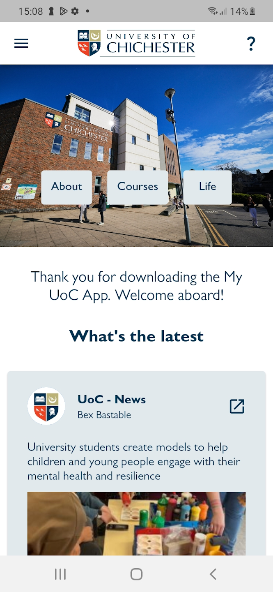
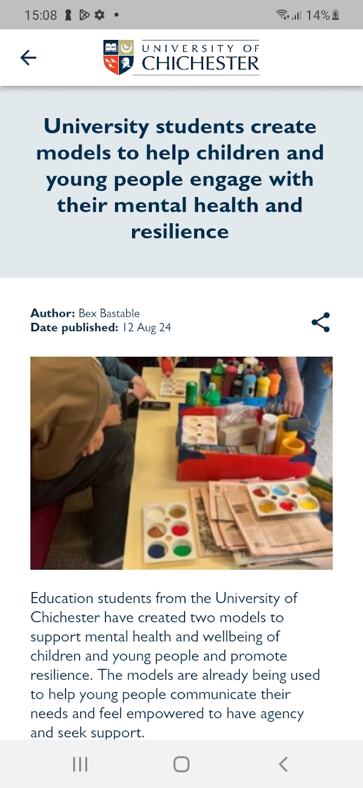
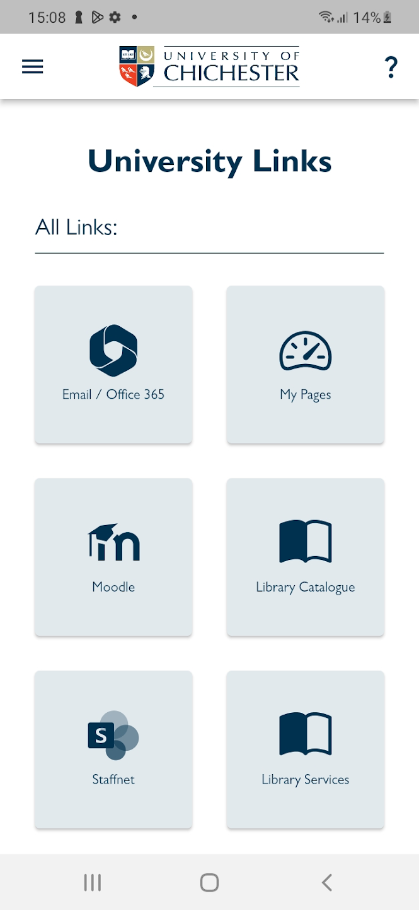
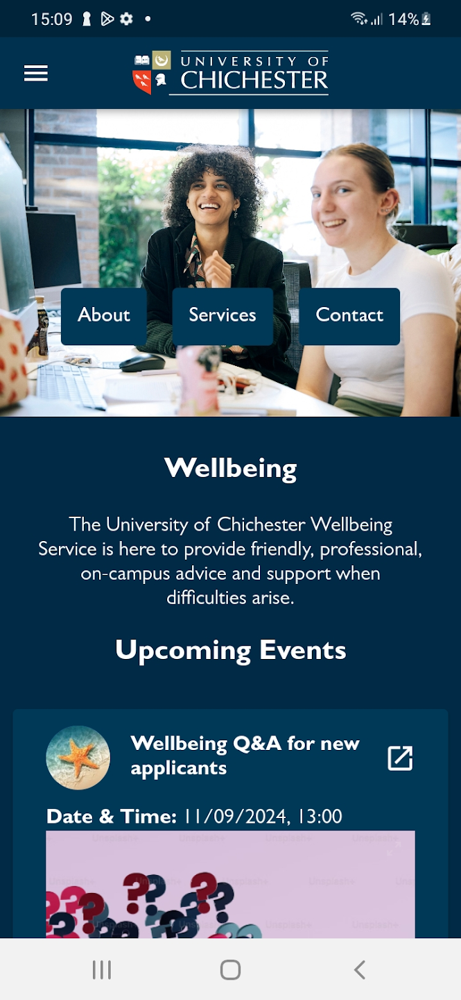
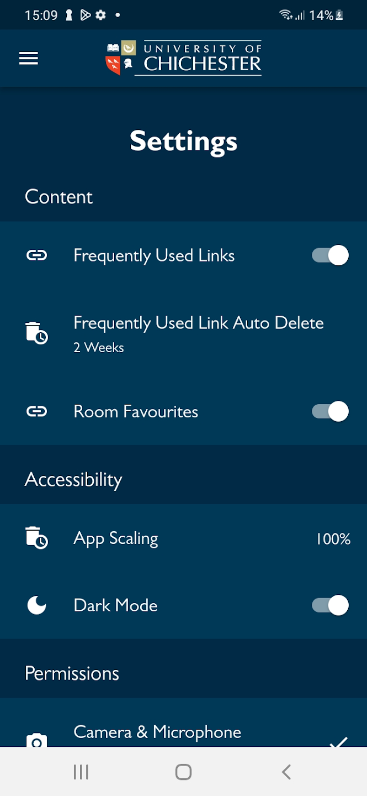

# My UoC – University Mobile Application

> **Portfolio Showcase**
> This repository showcases **My UoC**, a cross-platform mobile application that I designed and developed using Flutter during my Digital Technology Solutions Degree Apprenticeship at the University of Chichester.
>
> The application is available on both the Apple App Store and Google Play Store and is actively used by members of the University of Chichester community.
>
> **Note:** The source code is not publicly available as it was developed during my employment and remains the intellectual property of the University of Chichester.

---

# Project Overview

My UoC was created to provide students and staff with a single mobile application for accessing university services, resources and information.

The goal of the project was to replace the need for users to visit multiple websites by bringing commonly used services together into a modern, intuitive mobile experience.

The application provides quick access to university systems, campus information, wellbeing resources, student union updates and support services, all within a single cross-platform application.

---

# Live Application

The application is available on both major mobile platforms.

## Apple App Store

https://apps.apple.com/gb/app/my-uoc/id6633432852

## Google Play Store

https://play.google.com/store/apps/details?id=uk.ac.chi.my_uoc

---

# Background

Students often need to access numerous university systems throughout the day, including virtual learning environments, campus maps, wellbeing services, news and student union information.

These services were previously spread across multiple websites, making them difficult to discover and inconvenient to access from mobile devices.

The My UoC application was developed to provide a central gateway to these resources while delivering a modern mobile experience across both iOS and Android.

The project involved designing, developing, testing and deploying a production-ready application for real users.

---

# Features

## University News

* Latest university news articles
* Important announcements
* Campus updates

## Quick Access

* Chiview
* Moodle
* Campus Maps
* Latest University Links

## Student Union

* Events
* Activities
* Latest updates

## Wellbeing

* Student wellbeing resources
* Support information

## QR Code Scanner

* Scan room QR codes
* View room schedules
* Navigate campus

## Support

* Phone support
* Email support
* Web chat

## Settings

* Customisable application settings
* User preferences

---

# Technologies Used

## Mobile Development

* Flutter
* Dart

## Platforms

* Android
* iOS

## Deployment

* Google Play Store
* Apple App Store

---

# My Contribution

I was responsible for the design, development and deployment of the application, including:

* Flutter application development
* User interface implementation
* Cross-platform compatibility
* QR code scanner integration
* App Store deployment
* Google Play deployment
* Bug fixing
* Feature enhancements
* Ongoing maintenance

---

# Skills Demonstrated

This project demonstrates experience with:

* Cross-platform mobile development
* Flutter
* Dart
* Mobile UI/UX design
* Mobile application architecture
* Native device functionality
* Production deployment
* App Store publishing
* Google Play publishing
* Supporting production applications
* Software maintenance

---

# Challenges

Some of the technical challenges involved in developing the application included:

* Creating a consistent user experience across Android and iOS
* Optimising layouts for different screen sizes
* Managing application updates through both app stores
* Integrating device features such as QR code scanning
* Designing an intuitive navigation structure
* Delivering a reliable application suitable for production use

---

# Screenshots

## Home Screen

---

## University News

---

## Resources

---

## Student Wellbeing

---

## Settings

---

# What I Learned

Developing My UoC strengthened my understanding of:

* Cross-platform mobile development
* Flutter architecture
* Mobile application deployment
* App Store submission processes
* User-centred design
* Supporting production software
* Maintaining applications used by real users

---

# Project Outcome

The application was successfully released on both the Apple App Store and Google Play Store and continues to provide members of the University of Chichester community with quick access to essential university resources and services.

Developing My UoC provided valuable experience delivering a complete software product, from initial concept and development through to deployment, maintenance and ongoing feature improvements.

---

# Repository Purpose

This repository exists to showcase one of the major projects completed during my Degree Apprenticeship.

Although the source code cannot be made publicly available, this repository demonstrates my experience designing, developing and deploying a production mobile application using Flutter for both Android and iOS.
